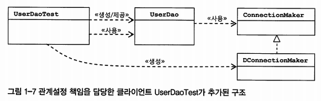

# Spring #2

범위: 83p~142 1.3.4 원칙과 패턴~

지난 시간에는 관심사에 따라 UserDao와 ConnectionMaker 클래스를 나누고

ConnectionMaker가 바뀔 수 있어 사용해 Interface로 분리해 다른 클래스들이 수정될 필요가 없도록 만들었음.



지난 시간까지 한 것들

### 개방 폐쇄의 원칙(OCP Open Close Principle)

- 클래스나 모듈은 확장에는 열려 있어야 하고 변경에는 닫혀 있어야 함
- 갖다 쓰기는 편하지만 외부의 변화가 코드에 영향을 적게 받도록 설계되어야 함
- 자신의 책임 자체가 변경되는것이 아니면 불필요한 변화가 발생하지 않도록 막고, 자신이 가지고 있는 외부 오브젝트의 기능은 자유롭게 확장하거나 변경할 수 있게 만들어야 함.

적용:

- 변경(확장)될 것과 변하지 않을 것을 엄격히 구분
- 이 두 모듈이 만나는 지점에 인터페이스를 정의
- 구현에 의존하기보다 정의한 인터페이스에 의존하도록 코드를 작성

SOLID의 O를 담당함

- 높은 coherence: 1모듈에 집중된 책임/관심사
- 낮은 coupling: 하나 수정했을 때 생기는 여파 정도

### 전략패턴

ConnectionMaker가 바뀔 수 있어 사용해 Interface로 분리해 다른 클래스들이 수정될 필요가 없도록 만들었음.

개방 폐쇄 원칙의 실현에도 가장 잘 들어맞는 패턴임. 전략 패턴은 자신의 기능 맥락(context)에서, 필요에 따라 변경이 필요한 알고리즘(독립적인 책임으로 분리가 가능한 기능)을 인터페이스를 통해 통째로 외부로 분리시키고, 이를 구현한 구체적인 알고리즘 클래스를 필요에 따라 바꿔서 사용할 수 있게 하는 디자인패턴.

```java
// springbook/user/dao/ConnectionMaker.java
public interface ConnectionMaker {
    public Connection makeNewConnection();
}

// springbook/user/dao/NConnectionMaker.java
public class NConnectionMaker implements ConnectionMaker{
    public Connection makeNewConnection(){
        // ...
    }
}

// springbook/user/dao/UserDao.java
public class UserDao { 
    private Connection connection
    public void UserDao(Connection connection){
        this.connection = connection;
    }
    
    // ...
}

// springbook/user/dao/UserDaoTest.java (main class)
public class UserDaoTest {
    public static void main(String[] args) {
        ConnectionMaker ncm = new NConnectionMaker();
        UserDao dao = new UserDao(ncm);
        // ...
    }
}
```

## 1.4 IoC

UserDaoTest 코드를 다시보면 coupling되어있음.

Test코드에서 어떤 Connection을 해줘야 하는지 구구절절 만들어 전달해줘야 하는 문제가 발생

```java
public class UserDaoTest {
    public static void main(String[] args) {
        ConnectionMaker ncm = new NConnectionMaker();
        UserDao dao = new UserDao(ncm);
        // ...
    }
}
```

따라서 아래처럼 변경한다.

```java
// springbook/user/dao/DaoFactory  // test나 main에서나 둘다 사용
public class DaoFactory {
    public UserDao userDao() {
        ConnectionMaker ncm = new NConnectionMaker();
        UserDao userDao = new UserDao(ncm); 
        return userDao;
    }

// springbook/user/dao/UserDaoTest
// ...
    UserDao dao = new UserDaoFactory().userDao(); //깔끔!
// ...
```

### **팩토리**

객체의 생성 방법을 결정하고 만들어진 object를 돌려주는 object
(factory method pattern과는 다름)


스프링으로 접목해서 보면..

- `Bean` : 스프링이 생성과 제어를 직접 담당하는 Object
- `Bean Factory` : Bean에 대한 제어를 담당하는 IoC Object
- `Application Context` : BeanFactory를 extends한 컨테이너. 별도의 정보를 참고해서 Bean생성, 관계설정 등의 제어 작업을 총괄함. 범용. 설정정보를 가져와 DaoFactory기능을 수행한다. 범용 IoC엔진
스프링의 각종 부가 서비스를 빈 팩토리에 얹었다고 보면 된다. 위의 DaoFactory(설계도)가 여기에 해당함. (같은 용어들 : IoC 컨테이너, 스프링 컨테이너, 빈 팩토리, 스프링, 싱글톤 레지스트리)

"같은 용어라고 알고 있되, `Bean Factory`라고 말할 때는 "빈을 생성하고 제어(관계를 설정)"하는 IoC의 기본 기능에 초점을 맞춘 것이고, `Application Context`라고 말할 때는 애플리케이션 전반에 걸쳐 모든 구성요소들의 제어 작업을 담당하는 IoC 엔진이라는 의미에 초점을 맞췄다고 생각할 것"

```java
@Configuration  // application context 또는 bean factory가 사용할 설정정보
public class DaoFactory {
    @Bean       // object생성을 담당하는 IoC용 메소드
    public UserDao userDao() {
        return new UserDao(connectionMaker()); 
    }
    
    @Bean
    public ConnectionMaker connectionMaker(){
        return new NConnectionMaker();
    }
}

// springbook/user/dao/UserDaoTest
public class UserDaoTest {
	public static void main(String[] args) throws ClassNotFoundException, SQLException {
		AnnotationConfigApplicationContext applicationContext = new AnnotationConfigApplicationContext(AppConfig.class);
		UserDao dao = applicationContext.getBean("userDao", UserDao.class);
......
```

### 1.5.2  애플리케이션 컨텍스트의 동작방식


client가 getBean()으로 userDao를 요청하면, ApplicationContext내에서 빈 목록을 조회하여 singleton 객체를 돌려줌.
—> Client가 Factory 클래스를 몰라도 된다. 

### 1.6 싱글톤 레지스트리와 오브젝트 스코프

스프링 프레임워크는 싱글톤 레지스트리의 기능을 한다. 즉, 평범한 자바 클래스를 싱글톤으로 사용하면서 싱글톤 패턴의 장점만 취할 수 있게 해준다. 스프링은 별다른 설정을 하지 않으면 기본적으로 싱글톤으로 만든다. 엔터프라이즈 환경이기 때문에...

### 1.7 DI: 의존성 주입..의존관계 설정.. 의존관계 주입

### 의존관계

의존관계에 있다는 말은 항상 방향성을 부여해줘야 함.
의존한다는 건 의존대상, B가 변하면 A에 영향을 미친다는 뜻.(ex. A가 B에 의존할때 즉, A -> B)
반대로 B는 A에 의존하지 않는다. 즉, B는 A의 변화에 영향을 받지 않음.


A가 B에 의존하고 있음

**의존관계 주입**이란 구체적인 의존 오브젝트와 그것을 사용할 주체(일반적으로 클라이언트) 오브젝트를 런타임 시에 연결해주는 작업을 말함.


DConnectionMaker 등이 변화가 있어도 UserDao에 영향을 주지 않음. Maker가 의존관계 주입 역할을 해 줌.

이렇게 인터페이스에만 의존관계를 두어 관계를 느슨하게 만드는 것은 결합도가 낮다고 설명할 수 있음.

Dao에서 직접 MyConnectionMaker를 생성하던 것을 제 3자인 클라이언트나 팩토리, 애플리케이션 컨텍스트에게 맡긴 것을 생각하면 됨. 이러한 제 3자들은 `DI 컨테이너`라고 부를 수 있음.

DI는 자신이 사용할 오브젝트에 대한 선택과 생성 제어권을 외부로 넘기고 자신은 수동적으로 주입받은 오브젝트를 사용한다는 점에서 IoC의 개념에 잘 들어맞는다.

### DI 구현 방법

XML을 사용해도 이 세가지 정보를 정의할 수 있다.

```java
//단, 설정 xml을 지정은 해 줘야 한다.
ApplicationContext context = new GenericXmlApplicationContext("applicationContext.xml");
```

[제목 없음](https://www.notion.so/6c10680efe0c4b14bf03084875c0bf84)

Data factory 대신 XML을 사용할 수 있음. (사실 xml말고 쓰는 것을 못봤음...)

```xml
<?xml version="1.0" encoding="UTF-8"?>
<beans xmlns="http://www.springframework.org/schema/beans"
       xmlns:xsi="http://www.w3.org/2001/XMLSchema-instance"
       xsi:schemaLocation="http://www.springframework.org/schema/beans
        http://www.springframework.org/schema/beans/spring-beans-3.0.xsd">

    <bean id="connectionMakerId" class="springbook.user.dao.NConnectionMaker"/>

    **<bean id="userDao" class="springbook.user.dao.UserDao">**
        **<property name="connectionMaker" ref="connectionMaker"/>**
    </bean>
</beans>
```

질문: 스프링은 싱글톤 객체로서 움직이는데, 단시간 내에 다른 조회 요청건이 있을 경우 (A유저, B유저) 내부 메모리는(객체 상태는) 어떻게 관리되는 건가요?
—> 뇌피셜: 한 pool내 request마다 각 객체가 관리.