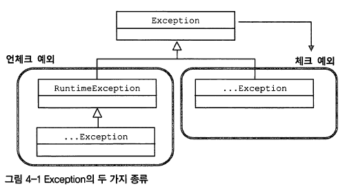

# Spring 6주차

범위: 259~ 3.6 스프링의 JdbcTemplate

발표일: 2/9(화) 21:00

원본링크: https://www.notion.so/engcreed/Spring-6-acacd4bf612e450caece4c547c9f3057

# 4장 예외

## 초난감 예외처리

1. 예외를 무시하지 말자
뒷일은 감당 못한다.

    ```java
    try {
    	...
    } catch (Exception e) {
    	//예외를 잡고 아무것도 하지 않는 것. 예외 블랙홀...
    }
    ```

2. 무의미하고 무책임한 예외처리도 하지 말자
어떤 예외가 발생했는지 알 수 없기 때문에 어떻게 대처해야 할 지 알 수 없음.

    ```java
    public void method1() throws Exception {
    	method2();
    }

    public void method2() throws Exception {
    	method3();
    }
    ...
    ```

## 예외 종류와 특징

- unchecked Exception: 컴파일에 문제 없고 코드를 잘못 만들어서 생기는 예외 (`NPE`)
- Checked Exception: 컴파일러가 check하는 예외 (`ClassNotFound`)
1. `java.lang.Error` 클래스의 서브 클래스: **Error**
    - 애플리케이션에선 처리를 고민하지 않아도 된다. 할 수 있는게 없으니까....
    - `OOM`, `ThreadDeath`

    

    1. `java.lang.RuntimeException` 상속한 클래스: **unchecked exception**
        - 예외 처리를 강제하지 않음.
        - 피할 수 있지만 개발자의 부주의로 인해 발생할 수 있는 경우에 발생.
        - 주로 프로그램의 오류가 있을 때를 상정함. (`NPE`, `IllegalArgumentException`)
        - 부주의했던 개발자가 나쁜 놈이므로 catch나 throw는 필요가 없다
    2. **Checked Exception**
        - 체크 예외를 던진다면 반드시 `catch`를 잡든지, 다시 `throws`를 정의해서 던져야 한다. (하지 않는다면 컴파일 에러 발생)
        - **반드시 잡아서 처리해라!**
        - 하지만 최근 등장하는 API들은 예상 가능한 예외상황을 다루는 예외를 체크예외로 만들지 않는 경향이...

## 예외처리 방법

복구할 건 복구하자. 가망이 없으면 관리자에게 알릴 수 있도록 처리하자.

1. **예외 복구**
예외 상황을 파악하고 문제를 해결해서 **정상 상태**로 돌려놓는 것
예외가 처리됐으면 사용자에겐 예외상황으로 비쳐도 **애플리케이션은 정상운전 되어야** 함.
ex) 네트워크 불안으로 인한 SQL 재시도
2. **예외 처리 회피**
예외처리를 자신이 담당하지 않고, 자신을 호출한 쪽으로 던져버리는 것(`throws`)
예외처리 책임을 받을 객체는 긴밀한 관계에 있는 객체이며 처리해줘야 함.
예외 처리 회피 시, 최선이라는 확신이 있어야 하고 의도가 분명해야 함. 그렇지 않다면 무책임한 책임회피.
ex) method의 `throws`, 혹은 try-catch의 `throw exception`
3. **예외 전환**
예외를 밖으로 던진다는 것은 예외 처리 회피와 비슷하지만, 그대로 넘기지 않고 적절한 예외로 전환해서 던진다.
    1. 로우 레벨 예외의 의미를 분명하게 하기 위해 (추상화 된 예외로 전환)
    ex) `SQLException` → `DuplicateUserIdException` . 중첩으로 해줘서 처음 발생한게 무엇인지 알려주도록 하자.
    2. 예외 처리를 단순하게 하기 위한 포장
    checked exception을 unchecked error(runtime error)로 바꾸기 위해. (가망없는 예외는 빠른 손절)
    ex) EJB컴포넌트에서 발생하는건 비즈니스성 예외거나 복구 가능한 예외가 아님.
    가망 없는 예외는 빨리 runtime error로 포장해 던져 불필요 throw를 줄이는게 좋다.

> 가망 없는 예외는 **관리자가 인지할 수 있도록** runtime 예외로 포장해서 던진다.
핸들링 해줄 수 있거나 로직상의 예외라면 **체크예외를 통해 대응 및 복구**를 하도록 한다.

# 예외처리 전략

잘 쓰려면 어떻게 해야할까?

## **Runtime Exception의 보편화**

주로 Java는 BE에서 사용하면서 checked exception 활용도와 가치는 점점 떨어지고 있음. 불필요한예외라면 빠르게 runtime Error로 전환해서 던지는게 낫다. 십중팔구는 복구 불가능한 상황이기 때문이다.

그리고 요청처리 중 예외가 발생하면 요청을 중단시키면 그만이다. 또 하겠지.

add() 메서드 예외처리

ID중복 발생 시 상황에 맞는 예외를 던지도록 add()수정

```java
// 런타임 예외이기 때문에 throws 없어도 됨
public void add(final User user) throws DuplicateUserIdException {
  try {
    this.jdbcTemplate.update("insert into users(id,~~~)
    // 내부에서 throw new SQLException 을 던져 줌. err code=DuplicateUserIdException.ERROR_DUPLICATED_ENTRY);
  } catch (SQLException e) {
    if (e.getErrorCode() == DuplicateUserIdException.ERROR_DUPLICATED_ENTRY) {
      throw new DuplicateUserIdException();
			// 예외 전환(SQLException -> DuplicateUserIdException)

    } else {
      throw new RuntimeException(e);// 예외 포장
    }
  }
}
```

## **애플리케이션 예외**

catch로 조치를 강제하는 예외. 비즈니스 로직 상 제약이 있는 경우 사용한다. (통장잔고의 문제)

1. return코드로 조건을 분기시킴. 공감대 있는 표준이 없으므로 code사전이 필요할지도 모른다.
2. 상황에 맞는 checked Exception을 던지도록 한다.
exception에 대한 구현을 강제해준다. 코드도 기본로직과 예외가 구분되어 보기도 편안해진다.

    ```java
    try {
      BigDecimal balance = account.withdraw(amount);
      ...
    // checked exception
    } catch (InsufficientBalanceException e) {
      // InsufficientBalanceException에 담긴 인출 가능한 잔고금액 정보를 가져옴
      Bigdecimal availableFunds = e.getAvailableFunds();
      // 잔고 부족 안내 메시지를 준비하고 이를 출력하도록 진행
    }
    ```

## SQLException은 어떻게 됐나?

DAO에서 SQLException이 모두 사라졌다. Spring API에 정의되어 있는 대부분의 예외는 Runtime Exception이므로 처리하도록 강제하지 않는다. 꼭 필요한 경우에만 잡아서 처리해도 된다.

# 4.2 예외 전환

### **JDBC의 한계**

JDBC: 추상화된 API, 각 드라이버가 구현체를 제공함. 그래서 DB를 모르고 마음대로 구현해도 될 것 같지만 두 가지 걸림돌이 있음.

**비표준 SQL** 

DB특성을 타는 쿼리를 작성할 수밖에 없다. DAO를 각각 DB별로 쓰던가. 표준만 쓰다가는...

**호환성 없는 에러정보**

DB마다 SQL 뿐만 아니라 에러의 종류와 원인도 제각각이다. 그래서 JDBC는 데이터 처리 중에 발생하는 다양한 예외를 그냥 SQLException 하나에 모두 담아버린다. 그래서 자세한 원인을 보려면 제조사의 에러코드를 확인하는게 더욱 정확함.

### DB 에러 코드 매핑을 통한 전환

스프링은 `DataAccessException`이라는 `SQLException`을 대체할 수 있는 런타임 예외를 정의하고 있을 뿐 아니라 `DataAccessException`의 서브클래스로 세분화된 예외 클래스들을 정의하고 제공하고 있음.

JdbcTemplate은 `SQLException`을 단지 런타임 예외인 `DataAccessException`으로 포장하는 것이 아니라 DB의 에러 코드를 `DataAccessException` 계층구조의 클래스 중 하나로 매핑해준다.
전환되는 JdbcTemplate에서 던지는 예외는 모두 `DataAccessException`의 서브클래스 타입으로, DB별로 미리 준비된 매핑정보를 참고해서 적절한 예외 클래스를 선택하기 때문이 DB가 달라져도 같은 종류의 에러라면 동일한 예외를 받을 수 있음. 
**데이터 엑세스 기술에 독립적인 추상화된 예외를 제공하는 것**이다.

따라서 JdbcTemplate을 이용한다면 JDBC에서 발생하는 DB 관련 예외는 거의 신경 쓰지 않아도 된다.

## DAO 인터페이스와 DataAccessException 계층구조

`DataAccessException`은 JDBC의 `SQLException`을 전환하는 용도로만 만들어진 건 아니고, JDBC 외 자바 데이터 엑세스 기술에서 발생하는 예외에도 적용됨.

`DataAccessException`은 의미가 같은 예외라면 데이터 액세스 기술의 종류와 상관없이 일관된 예외가 발생하도록 만들어준다. 데이터 액세스 기술에 독립적인 추상화된 예외를 제공함.
ex) JPA, iBatis 등...

### DAO 인터페이스와 구현의 분리

이렇게 Exception을 한번 말아서 추상화 해 제공하는 이유는 데이터액세스 로직과 비즈니스 로직을 분리하기 위해서.

문제는 데이터 액세스 기술이 달라지면 같은 상황에서도 다른 종류의 예외가 던져진다는 점이다.

```java
public void add(User user) throws SQLException; //Jdbc api
public void add(User user) throws PersistentException; //JPA
public void add(User user) throws HibernateException; //Hibernate
```

위와 같이 `SQLException`을 던지도록 선언한 인터페이스 메소드는 데이터 엑세스 기술을 변경할 때 마다, 변경해주어야 한다는 문제가 발생한다.

즉, 데이터 액세스 기술이 달라지면 같은 상황에서도 다른 종류의 예외가 던져진다는 점이 문제다. (데이터 액세스 기술에 의존적인 코드가 된다.)

### 데이터 액세스 예외 추상화와 계층구조

스프링의 `DataAccessException`은 자바의 주요 데이터 액세스 기술에서 발생할 수 있는 대부분의 예외를 추상화하고 있으며 이런 기술에서만 공통적으로 나타나는 예외를 포함해서 데이터 액세스 기술에서 발상 가능한 대부분의 예외를 계층구조로 분류해놓았다.

결국 인터페이스 사용, 런타임 예외 전환과 함께 `DataAccessException` 예외 추상화를 적용해 놨으므로, 우리는 데이터 엑세스 기술과 구현 방법에 독립적으로 구현할 수 있다!

### DataAccessException 활용시 주의사항

DataAccessException이 기술에 상관없이 어느 정도 추상화된 공통 예외로 변환해주긴 하지만 근본적인 한계 때문에 완벽하다고 기대할 수는 없다. 따라서 사용시엔 조심해야 한다.
ex) `DuplicateKeyException` 은 JDBC의 경우 바로 DB error코드로 주지만, hibernate, JPA는 각각 알아서 재정의 한 Exception이므로 스프링에서는 최상단 `DataAccessException`으로 변환한다.
